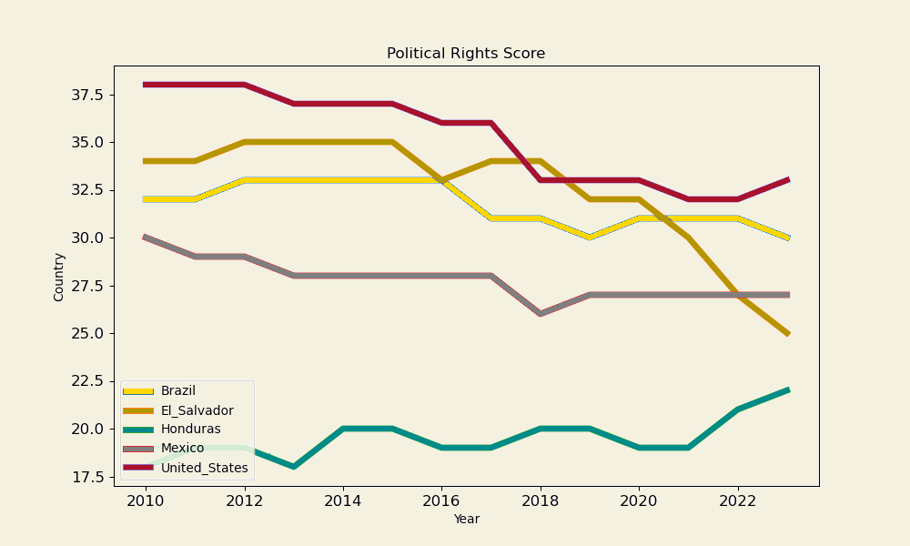

# **Incarceration Rates As A Measure of Governance: The United States vs. Latin America**
# **By Brandon Amarasingam, Elliot Jones, and Lorena Robles**

> ## PROBLEM STATEMENT
> ### What are the similarities between the United States incarceration rates and Latin American countries under civil unrest/authoritarian movements as it relates to  age and gender? 
---
> ## PROJECT OVERVIEW
>
> ####  According to the **Freedom House Project**-America's oldest organization defending democracy in the world- we are living in the midst of a growing global trend of democratic decline and rising authoritarianism. " Fewer than a fifth of the world's population now live in fully free countries [(source)]((https://www.google.com/search?channel=ftr&client=firefox-b-1-d&q=what+is+the+freedom+house+project%3F&dlnr=1&sei=qlwfZYGKNfHm0PEPrOKA2A4))."
>
> #### This data science project seeks to draw parallels in the trends of incarceration, by age and gender, across Brazil, El Salvador, Honduras, Mexico and the United States as they relate to the State of governance. Please, keep reading for an explanation on our choice of nations.  
>
> ### Political Rights Score(0-40) & Civil Liberties Score(0-60) by Country as calculated by the Freedom House Project: 
>
>  
>
> #### Please refer to our [Executive Summary](Executive_Summary.md) for the key insights and recommendations of our project. 
---
> ### DATA
> #### Description of the data 
> ### Data Dictionary
> |Feature|Type|Dataset|Description|
> |---|---|---|---|
>
>
> ### Data Acquisition, Ingestion and Cleaning   
>
>
---
> ## REQUIREMENTS FOR RUNNING THE CODE
> #### ACDFG
>
---
> ## TABLE OF CONTENTS
> ### &nbsp;&nbsp;A) [Executive Summary](Exe>cutive_Summary.md)
> ### &nbsp;&nbsp;B) [Coding_Notebooks](Coding_Notebooks)
>   
> ### &nbsp;&nbsp;&nbsp;&nbsp;&nbsp;&nbsp;&nbsp;&nbsp;1)[Exploratory_Data_Analysis](Coding_Notebooks\Exploratory_Data_Analysis)   
> ### &nbsp;&nbsp;&nbsp;&nbsp;&nbsp;&nbsp;&nbsp;&nbsp;2)[Modeling_Process](Coding_Notebooks\Modeling_Process)
> ### &nbsp;&nbsp;C) [Datasets](Datasets)
>    
> ### &nbsp;&nbsp;&nbsp;&nbsp;&nbsp;&nbsp;&nbsp;&nbsp;1) [Original_Data](Datasets\Original_Data)
> ### &nbsp;&nbsp;&nbsp;&nbsp;&nbsp;&nbsp;&nbsp;&nbsp;2) [Processed_Data](Datasets\Processed_Data)
> ### &nbsp;&nbsp;D) [Images](Images)
> ### &nbsp;&nbsp;E) [Presentation](Presentation)